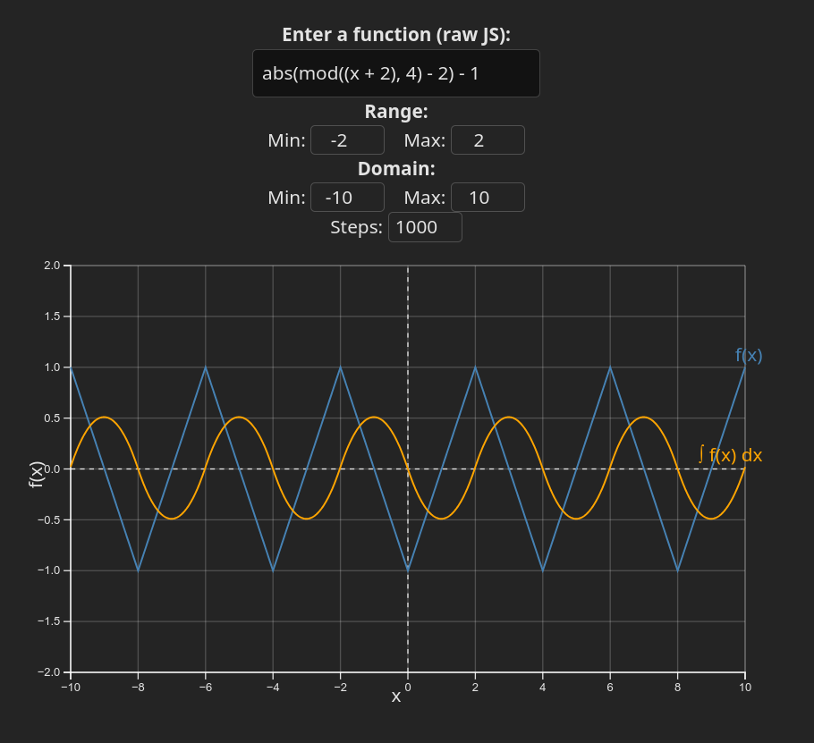

# Integral Plotter

I have fabricated a simple integral plotter using TypeScript and D3.js. The plotter is capable of plotting the integral of a function from 0 to 10 (can be adjusted in the code). The plotter uses the trapezoidal rule to calculate the integral.

The function is specified in the input field as plain JavaScript code. The code is then evaluated and the integral is calculated. The plotter is updated in real-time as the function is changed.

Here is an example:



I only made this because things like Desmos and GeoGebra weren't providing accurate results for functions that, at first glance, may have discontinuities, but in reality, don't. For example, the function `f(x) = |mod(x + 2, 4) - 2| - 1` seems like it should have a repeating discontinuity because `mod(x + 2, 4)` has a period of 4, but in reality, it doesn't (the `- 2` and absolute value make it so). Desmos and GeoGebra both incorrectly plot this function.

Desmos seems to calculate the integral by assuming each "line" of the function goes for infinity, and thus it calculates the integral of each line and sums them up. This is incorrect because the function is not a piecewise function. The integral plotter I made correctly calculates the integral of the function

## Limitations

The shown integral always starts at 0 on the left side of the plot. I'm sure you can imagine why.

## How to use

This project uses [`bun`](https://bun.sh) and [`vite`](https://vitejs.dev/). To run the project, clone the repository and run the following commands:

```bash
bun install
bun dev
```

The project should be running on `localhost:3000`.

## License

This project is licensed under the DBAD license. See the [LICENSE](LICENSE) file for more information.

TL;DR: Do whatever you want with this code, but don't blame me if something goes wrong.

## Contributing

I wrote this in like 15 minutes. I'll probably ignore any issues or pull requests. If you want to make a change, just fork the repository and do it yourself.
